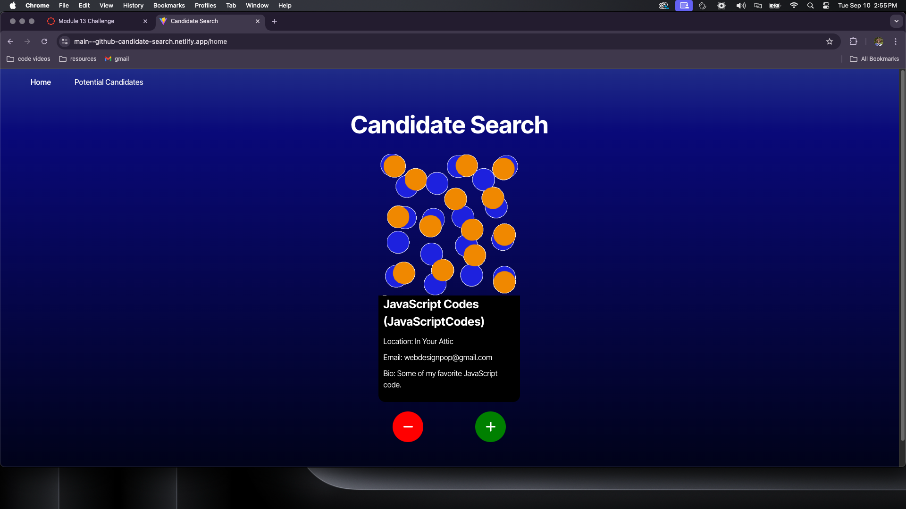

# Candidate Search

## Description
The Candidate Search App is a web application designed to streamline the process of finding potential candidates for job positions using the GitHub API. This app allows users to search for GitHub users based on specific criteria, review their profiles, and make decisions to either accept or reject them as potential candidates. Accepted candidates are then added to a table for further review and comparison.

## Table of Contents
- [Installation](#installation)
- [Usage](#usage)
- [License](#license)
- [Contributing](#contributing)
- [Tests](#tests)
- [Questions](#questions)

## Installation
In order to use this application, as it is a deployed project, no installation is required.

## Usage
To use this application you must visit the URL and the api will begin calling once you load the page. From there you can decide whether to decline or accept a user. If you choose to accept a user you can visit the saved candidates on the navbar and see into further detail and compare the users all together.

https://github.com/user-attachments/assets/c13af2dc-c958-4e37-bea6-091294057257

## License
This project is licensed under the [MIT](https://opensource.org/licenses/MIT) license.

## Contributing
Contributions are welcome! If you have suggestions for improvements or new features, please create an issue or submit a pull request. For major changes, please open an issue first to discuss what you would like to change. Thank you!

## Tests
There are no test instructions as of September 10th, 2024. This is subject to change as development can be further continued.

## Questions
If you have any questions, you can reach me at [berczikbryce@gmail.com](mailto:berczikbryce@gmail.com). You can also find more of my work at [bryceberczik](https://github.com/bryceberczik) on Github.
